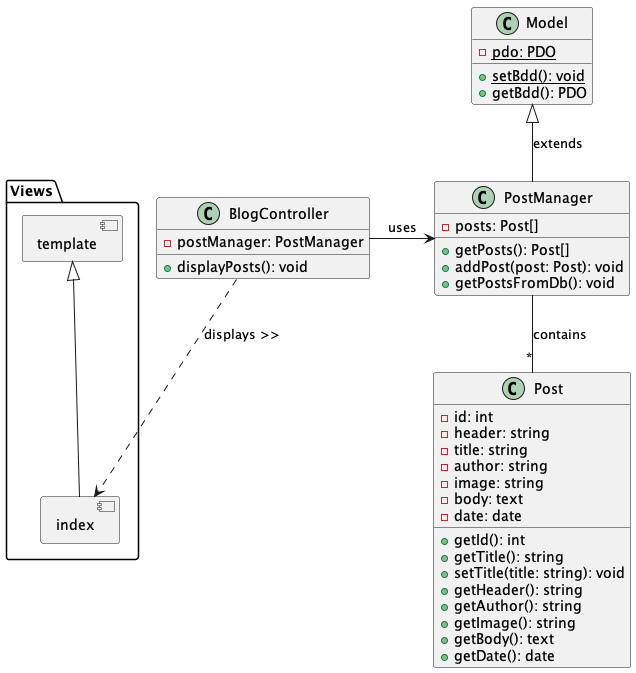

# PHP Blog Project

This project is intended for second-year Bachelor students. It serves as an introduction to Object-Oriented Programming (OOP) using PHP.

## Description

The project involves a simple blog where users can read articles. Each article is represented by a card that contains the title, author, image, and content of the article. Users also have the option to edit or delete articles.

## Installation

1. Clone this repository to your local machine.
2. Install dependencies using Composer. If you don't have Composer installed, you can download it from [https://getcomposer.org/](https://getcomposer.org/). Once you have Composer installed, navigate to the project directory in your terminal and run `composer install`.
3. Configure your web server to point to the project folder.
4. Import the database.sql file into your database management system.
5. Modify the database connection in .env with your database information.

## Utilisation

Navigate to your web server's URL. You should see the blog's homepage with all articles displayed.

## How it works

## Contribution

Contributions are welcome. Please open an issue or a pull request for any contribution.

## Licence

This project is licensed under the MIT License. See the LICENSE file for more details.
